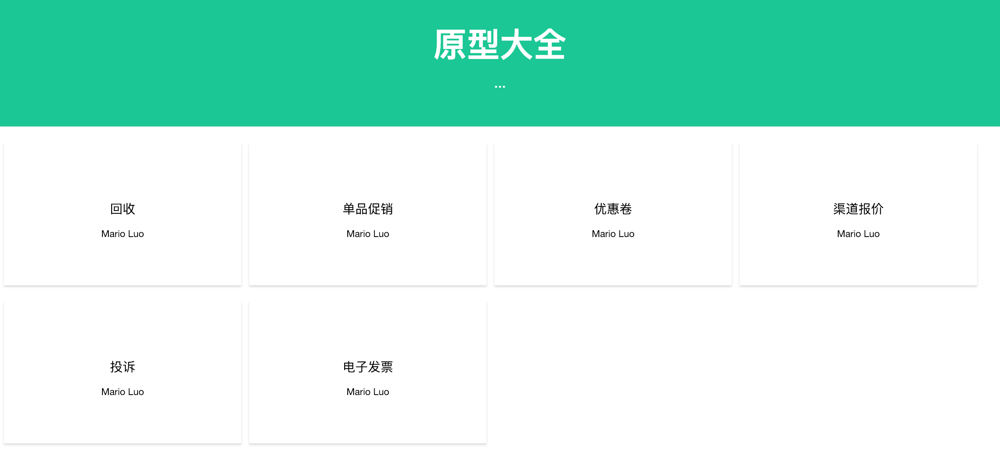

# Paper-Show: 快速简单地上传，以及预览HTML的web程序



## 背景
产品经理利用Axure设计原型, 需要快速、即时直接分享给开发、测试等人员, 
但是由于它自带的分享到网络的访问速度很慢, 所需要把原型(导出的静态文件)部署到自己的服务器,
最开始使用nginx来访问原型, 但是需要手动上传静态资源到服务器。

## 安装
- Docker
    ```shell
    docker run -d --restart always --name paper-show -p 8080:8080 -v /data/paper-show:/data lkqm/paper-show
    ```

- Source
    ```shell
    mvn clean pakcage -Dmaven.test.skip=true
    cd target
    java -jar paper-show.jar
    ```

访问: http://127.0.0.1:8080

注: 默认数据存储目录: ${HOME}/.paper-show, 项目元信息: project.json, 静态资源: project/

## 演示
1. 添加项目: 双击"原型大全"标题行, 显示添加项目弹框.
2. 上传文件(更新文件): 拖动文件到某个项目, 显示上传文件弹框
3. 预览: 单击某个项目, 跳转到地址: /v/{projectId}/{entrance}
