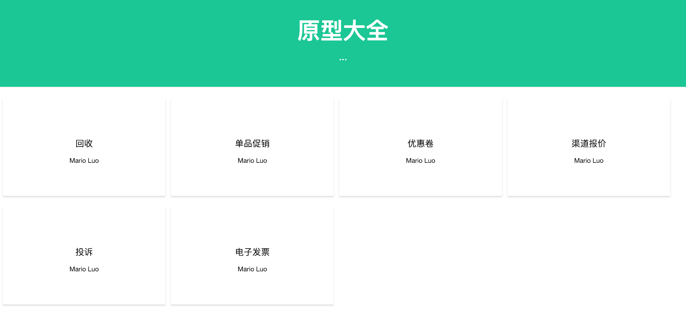
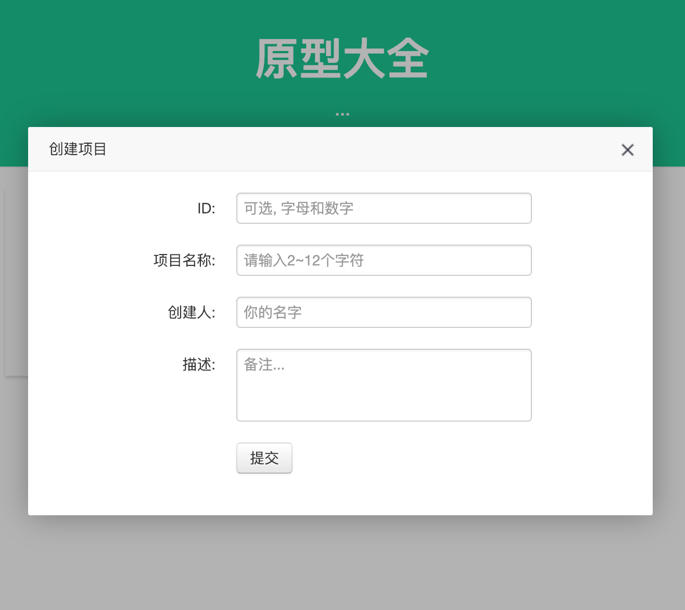
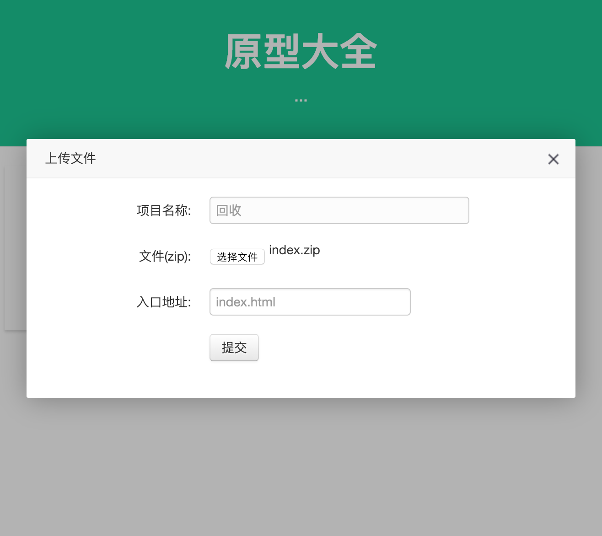

# Paper-Show: 快速简单地上传，以及预览HTML的web程序
> 需求背景

产品经理利用Axure设计原型, 需要快速、即时直接分享给开发、测试等人员, 
但是由于它自带的分享到网络的访问速度很慢, 所需要把原型(导出的静态文件)部署到自己的服务器,
最开始使用nginx来访问原型, 但是需要手动上传静态资源到服务器。



主要功能: 

- 创建项目,上传以及更新静态资源(HTML)(仅仅zip压缩格式)
- 预览

> 安装运行
```shell
    mvn clean pakcage -Dmaven.test.skip=true
    cd target
    java -jar paper-show.jar
    # 端口配置, 参见spring-boot, 启动参数配置
```

访问: http://127.0.0.1:8080

注: 默认数据存储目录: ${HOME}/.paper-show, 项目元信息: project.json, 静态资源: project/

> 功能演示

- 添加项目: 双击"原型大全"标题行, 弹出如下框:
    
- 上传文件: 拖动文件到某个项目, 弹出上传窗口:
    
- 预览静态资源: 单击某个项目, 地址: /v/{projectId}/{entrance}

